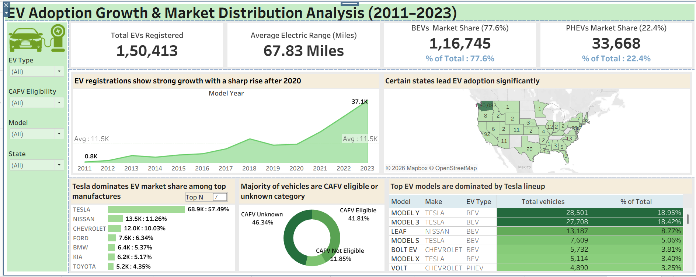

# 🚗 EV Adoption Growth & Market Insights Dashboard (2011–2023)

An interactive Tableau dashboard analyzing Electric Vehicle adoption trends, market share, manufacturer dominance, and regional distribution across the United States from 2011 to 2023.

🔗 **[View Live Interactive Dashboard](https://public.tableau.com/app/profile/abhin.gulam/viz/EVdashboard_newone/Dashboard1)**

---

## 📊 Dashboard Preview



---

## 📌 Problem Statement

The EV industry is growing rapidly, but stakeholders lack clear visibility into:
- How EV adoption has grown year over year
- Which states and regions are leading or lagging in EV uptake
- Which manufacturers and models dominate the market
- The real split between Battery Electric Vehicles (BEV) and Plug-in Hybrid Electric Vehicles (PHEV)

This project solves that by turning raw registration data into a clear, interactive dashboard for data-driven decision-making.

---

## 🎯 Objectives

- Analyze EV growth trends from 2011 to 2023
- Identify leading and lagging states in EV adoption
- Understand market share split between BEV and PHEV vehicle types
- Identify top EV manufacturers and models by registration volume

---

## 📂 Dataset

| Detail | Info |
|--------|------|
| **Source** | [Electric Vehicle Population Data — Kaggle](https://www.kaggle.com/datasets/ratikkakkar/electric-vehicle-population-data) |
| **Coverage** | 2011 – 2023 |
| **Total Records** | 1,50,413 EV registrations |
| **Scope** | State-wise, model-wise, and manufacturer-level EV registrations across the USA |

**Key Fields:**
`Model Year` · `State` · `Make` · `Model` · `EV Type` · `Vehicle ID` · `CAFV Eligibility` · `Electric Range`

---

## 🛠️ Tools Used

| Tool | Purpose |
|------|---------|
| **Tableau** | Dashboard building & interactive visualizations |
| **Excel** | Data cleaning & preparation |
| **Tableau Public** | Live dashboard hosting |

---

## 🔢 Calculated Fields (Tableau)

| Field | Description |
|-------|-------------|
| `% of Total Vehicles` | Each EV's share of total registered vehicles |
| `BEV Share (%)` | Battery Electric Vehicle percentage of total |
| `PHEV Share (%)` | Plug-in Hybrid Electric Vehicle percentage of total |
| `Year-Wise EV Growth` | Year-over-year growth in EV registrations |

---

## 📈 Key KPIs

| KPI | Value |
|-----|-------|
| **Total EVs Registered** | 1,50,413 |
| **Average Electric Range** | 67.83 Miles |
| **BEV Market Share** | 77.6% (1,16,745 vehicles) |
| **PHEV Market Share** | 22.4% (33,668 vehicles) |

---

## 💡 Key Insights

- 📈 **Sharp growth after 2020** — EV registrations jumped from an average of 11.5K/year to **37,100 in 2023 alone**, driven by policy incentives and falling battery costs
- ⚡ **BEVs dominate the market** — Battery Electric Vehicles hold **77.6% market share** vs 22.4% for PHEVs, showing the market is moving toward fully electric
- 🏆 **Tesla leads by a massive margin** — Tesla accounts for **57.49% (68,900 vehicles)** of top manufacturer registrations; Nissan is a distant second at 11.26%
- 🚗 **Tesla Model Y is the #1 model** — with 28,501 registrations (18.95% of total), followed by Model 3 at 27,708 (18.42%)
- 🗺️ **Adoption is geographically concentrated** — certain states like Washington lead significantly, while most states have very low EV penetration
- 🔋 **CAFV eligibility gap** — 41.81% of vehicles are CAFV eligible, but 46.34% fall in the unknown category, indicating a data and policy awareness gap

---

## 🏭 Top Manufacturers

| Manufacturer | Registrations | Market Share |
|-------------|---------------|--------------|
| **Tesla** | 68,900 | 57.49% |
| Nissan | 13,500 | 11.26% |
| Chevrolet | 12,000 | 10.03% |
| Ford | 7,600 | 6.34% |
| BMW | 6,400 | 5.37% |
| Kia | 6,200 | 5.17% |
| Toyota | 5,200 | 4.35% |

---

## 🚙 Top EV Models

| Model | Make | Type | Total Vehicles | % of Total |
|-------|------|------|----------------|------------|
| **Model Y** | Tesla | BEV | 28,501 | 18.95% |
| **Model 3** | Tesla | BEV | 27,708 | 18.42% |
| Leaf | Nissan | BEV | 13,187 | 8.77% |
| Model S | Tesla | BEV | 7,609 | 5.06% |
| Bolt EV | Chevrolet | BEV | 5,732 | 3.81% |
| Model X | Tesla | BEV | 5,114 | 3.40% |
| Volt | Chevrolet | PHEV | 4,890 | 3.25% |

---

## 🏢 Business Recommendations

1. **Target low-adoption states** — the map shows most states have very low EV uptake; focused government incentives and manufacturer campaigns in these regions can unlock major growth
2. **Resolve CAFV unknown category** — 46.34% of vehicles have unknown CAFV eligibility; improving data collection and consumer awareness can boost incentive uptake
3. **Expand charging infrastructure** — infrastructure gaps are the primary barrier in low-adoption regions; public-private investment is critical
4. **Diversify beyond Tesla** — with Tesla at 57% share, the market is over-concentrated; incentivising other manufacturers can build a healthier, more competitive EV ecosystem

---

## 📁 Repository Structure

```
ev-adoption-tableau/
│
├── README.md                        ← Project documentation
├── dashboard.png                    ← Dashboard screenshot
└── EV dashboard_new one.twbx        ← Tableau packaged workbook
```

---

## 🚀 How to View

**Option 1 — Live Interactive Dashboard (Recommended)**
👉 [Click here to view on Tableau Public](https://public.tableau.com/app/profile/abhin.gulam/viz/EVdashboard_newone/Dashboard1)

**Option 2 — Local**
1. Download `EV dashboard_new one.twbx` from this repo
2. Open with [Tableau Public Desktop](https://public.tableau.com/en-us/s/download) (free)

---

## 👤 Author

**Abhin Gulam**
- 💼 [LinkedIn Profile](linkedin.com/in/abhin-gulam-a2737a313)
- 🐙 [GitHub](https://github.com/abhingulam)

---

`Tableau` `Data Visualization` `EV Analytics` `Electric Vehicles` `Market Analysis` `Interactive Dashboard` `Business Intelligence` `Data Analytics Portfolio`
